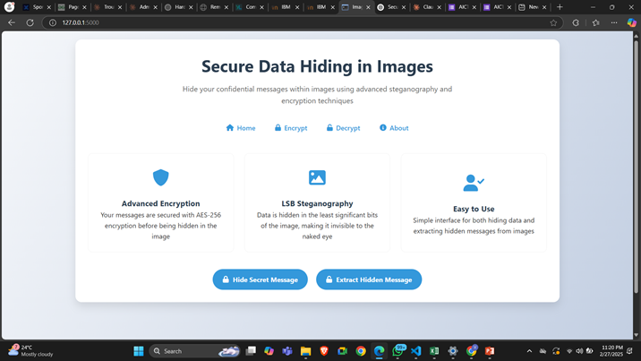

# Secure Image Steganography Application



A web application that allows users to hide encrypted secret messages within images using LSB (Least Significant Bit) steganography and AES-256 encryption.

## 📋 Features

- **Message Hiding**: Securely embed secret text messages inside images
- **AES-256 Encryption**: All messages are encrypted before hiding using AES-256 bit encryption
- **LSB Steganography**: Uses least significant bit technique to hide data with minimal visual impact
- **User-Friendly Interface**: Modern, responsive design that works on desktop and mobile devices
- **Secure Processing**: All encryption and steganography processing happens on the server
- **No Data Storage**: Your images and messages are never permanently stored on the server

## 🚀 Live Demo

[Visit the Application](https://yourwebsite.com/stego) (Replace with actual link if deployed)

## 🛠️ Installation

### Prerequisites

- Python 3.7+
- Flask
- Pillow (PIL)
- NumPy
- Cryptography

### Setup Instructions

1. Clone the repository:
   ```bash
   git clone https://github.com/yourusername/secure-image-steganography.git
   cd secure-image-steganography
   ```

2. Create and activate a virtual environment (recommended):
   ```bash
   python -m venv venv
   # On Windows
   venv\Scripts\activate
   # On macOS/Linux
   source venv/bin/activate
   ```

3. Install the required dependencies:
   ```bash
   pip install -r requirements.txt
   ```

4. Run the application:
   ```bash
   python app.py
   ```

5. Open your web browser and navigate to:
   ```
   http://127.0.0.1:5000
   ```

## 📖 How to Use

### Hiding a Message in an Image

1. Click on "Encrypt" in the navigation menu
2. Upload an image (PNG format recommended)
3. Enter your secret message in the text area
4. Provide a strong encryption key (remember this key!)
5. Click "Hide Message in Image"
6. Download the resulting steganographic image

### Extracting a Hidden Message

1. Click on "Decrypt" in the navigation menu
2. Upload the steganographic image
3. Enter the encryption key that was used when hiding the message
4. Click "Extract Hidden Message"
5. The hidden message will be displayed if decryption is successful

## 🔒 Security Considerations

- **Encryption Key**: Your encryption key is never stored and cannot be recovered if lost
- **Image Quality**: Use PNG images for best results as they use lossless compression
- **Image Size**: Larger images can hide more data and reduce the chance of visual artifacts
- **File Transfers**: Be aware that some platforms (like social media) may compress your images, potentially destroying the hidden data
- **Encryption Strength**: AES-256 encryption provides strong protection for your hidden messages

## 🔧 Technical Details

### How It Works

1. **Encryption**: Your message is first encrypted using AES-256 in CBC mode with a key derived from your password
2. **Steganography**: The encrypted data is then hidden in the least significant bits of the pixel values
3. **Retrieval**: When extracting, the process is reversed - first extracting the encrypted data, then decrypting it

### Technologies Used

- **Backend**: Flask (Python web framework)
- **Encryption**: AES-256 via Python's cryptography library
- **Image Processing**: PIL (Pillow) and NumPy for efficient image manipulation
- **Frontend**: HTML, CSS, JavaScript with modern responsive design
- **Icons**: Font Awesome for UI elements

## 🔍 Limitations

- The amount of data that can be hidden depends on the image size
- Any image manipulation (resizing, compression, etc.) after hiding data may corrupt the hidden message
- The application is designed for text messages; binary data may require additional encoding

## 👨‍💻 Developer

**Vaibhav Sharma**
- Cybersecurity Enthusiast & Developer
- [GitHub](https://github.com/itsvaibhavsharma)
- [LinkedIn](https://linkedin.com/in/itsvaibhavsharma)

## 📄 License

This project is licensed under the MIT License - see the [LICENSE](LICENSE) file for details.

## 🤝 Contributing

Contributions are welcome! Please feel free to submit a Pull Request.

1. Fork the repository
2. Create your feature branch (`git checkout -b feature/amazing-feature`)
3. Commit your changes (`git commit -m 'Add some amazing feature'`)
4. Push to the branch (`git push origin feature/amazing-feature`)
5. Open a Pull Request

## 📞 Support

If you encounter any issues or have questions, please [open an issue](https://github.com/yourusername/secure-image-steganography/issues) on GitHub.